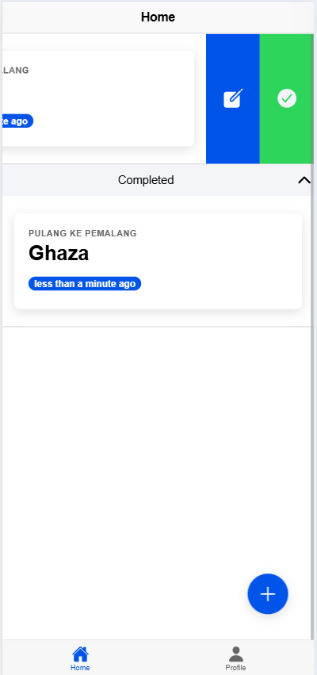
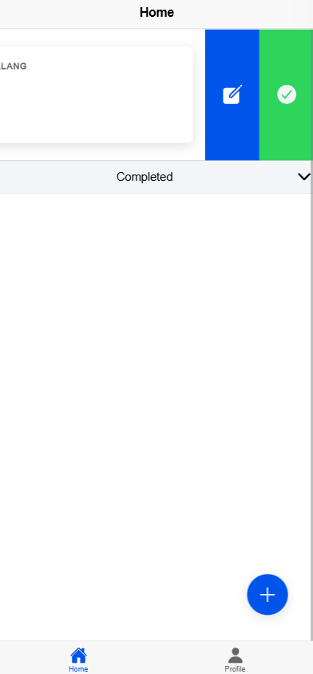

# tugas 9 dan 10 

Nama    : Ghaza Indra Pratama
NIM     : H1D022073
Shift C -> Shift D

# tugas 9

## Halaman Login

halaman login memiliki tombol untuk signin menggunakan auth google dengan firebase

### Pop up Login

Pop up login menampilkan akun login yang akan digunakan

### Gagal Login 

jika memencet tombol close maka auth akan gagal dan muncul pop up gagal

### berhasil login
Jika berhasil Login maka akan berpindah halaman home

## Halaman Home

pada homepage terdapat 2 tab pada bawah yaitu menuju home dan menuju halaman profile

## Halaman Profile

Halaman profil berisi 
- nama menggunakan ion-input
- email menggunakan ion-input
- profil menggunkan ion-avatar

## Alur Autentikasi dan Pengambilan Data Profil
### 1. Inisialisasi Firebase dan Google Auth
Aplikasi menginisialisasi Firebase dengan menggunakan konfigurasi dari file firebase.ts. Selain itu, Google Auth diatur menggunakan client ID yang telah terdaftar sebelumnya. Pinia store, dengan file auth.ts, disiapkan sebagai pengelola state untuk autentikasi user.

### 2. Proses Login
Ketika user menekan tombol "Sign In with Google", aplikasi akan memanggil method loginWithGoogle() dari Pinia store. Pada proses ini, Google Auth akan menampilkan popup untuk pemilihan akun. Setelah user memilih akun, Google memberikan token autentikasi yang kemudian digunakan untuk membuat credential pada Firebase. Data user yang berhasil login kemudian disimpan dalam state Pinia untuk kemudahan akses di seluruh aplikasi.

### 3. Pengambilan Data Profil
Setelah proses autentikasi berhasil, Firebase akan mengembalikan objek User. Data profil seperti nama, email, dan foto profil diambil dari objek tersebut. Data ini disimpan dalam Pinia store, sehingga dapat diakses oleh berbagai komponen dalam aplikasi. Pada komponen Profile, data ini diakses melalui computed property.

### 4. Proteksi Route
Untuk melindungi halaman tertentu, router guard (beforeEach) digunakan untuk memeriksa status autentikasi user. Halaman yang memerlukan autentikasi seperti home dan profile tidak dapat diakses jika user belum login, sehingga user akan diarahkan ke halaman login. Sebaliknya, jika user sudah login, halaman login tidak dapat diakses lagi.

### 5. Logout
Ketika user menekan tombol logout, aplikasi akan menjalankan method logout(). Proses ini mencakup pemanggilan fungsi signOut() pada Firebase dan Google Auth untuk mengakhiri sesi autentikasi. Setelah logout berhasil, state user di Pinia akan dibersihkan, dan user akan diarahkan kembali ke halaman login.

# Tugas 10

## add todo
### form todo

menambahkan todo menggunakan halaman baru dengan form input title dan description Setelah mengisi dan menekan tombol submit, todo baru akan ditambahkan ke dalam daftar dan langsung ditampilkan di halaman utama.

### after add

todo list akan muncul pada halaman home setelah disubmit

## edit todo

edit button terlihat dengan menggeser ke arah kiri dan terdapat button warna biru

### edit todo form

setelah menekan tombol edit maka akan muncul form edit. dapat mengubah title dan description lalu tekan tombol edit todo makan form baru terimput

### after edit

data todo yang telah diedit akan berubah pada homepage

## completed todo

tombol complete todo dapat ditemukan dengan menggeser kekiri lalu tekan tombol warna ijo

### after completed todo

setelah ditekan button completed maka akan muncul pada bagian completed.

## mengaktifkan todo 

untuk mengaktifkan todo dengan menggeser kekiri lalu tekan tombol warna kuning

### after aktifkan todo

setelah digunakan maka akan kembali keatas untuk todo

## mendelete todo

delete todo dapat ditemukan dengan geser kekanan dan tombol warna merah

### after delete

setelah ditekan tombolnya maka akan hilang dari halaman home

## Build APK Ionic dan Konfigurasi Firebase untuk Android

### 1. Persiapan Environment
Pastikan semua dependensi yang dibutuhkan sudah terinstal dengan benar di sistem Anda.

#### Instal Ionic CLI secara global
`` npm install -g @ionic/cli ``

#### Instal semua dependensi proyek
`` npm install ``

### 2. Menambahkan Platform Android
Tambahkan platform Android ke dalam proyek Ionic. Langkah ini hanya perlu dilakukan sekali saat pertama kali setup proyek.
`` ionic cap add android ``

### 3. Build Proyek Ionic
Lakukan build proyek Ionic untuk menghasilkan file-file yang dibutuhkan untuk aplikasi Android.
`` ionic build ``

### 4. Sinkronisasi dengan Capacitor
Setelah build selesai, lakukan sinkronisasi untuk memastikan semua perubahan terbaru masuk ke dalam proyek Android.
`` ionic cap sync android ``

### 5. Membuka Proyek di Android Studio
Buka proyek Android yang sudah di-generate untuk melakukan build APK.
`` ionic cap open android ``

### 6. Generate Signed APK
Setelah proyek terbuka di Android Studio, ikuti langkah-langkah berikut:
- Buka menu "Build" di toolbar Android Studio
- Pilih "Build App Bundle(s) / APK(s)"
- Lalu bisa pilih yang "Build APK(s)"
- Setelah berhasil terbuat maka akan muncul BUILD SUCCESSFUL
- Setelah proses build selesai, file APK dapat ditemukan di android/app/build/outputs/apk/release/app-release.apk

### 7. Config FIREBASE
- Buka CMD cari keystore dengan menuju ke direktori proyek Anda lalu ke direktori android dan ketikan:
`` gradlew signingReport ``
- Buka Firebase Console, lalu buka project vue-firebasenya dan pergi ke project settings
- Scroll ke bawah sampai menemukan "Your App" >> Klik "Add app" >> Pilih yang Android
- Ikuti langkah-langkahnya dan sesuaikan Package Name dengan appId yang ada di file ``capacitor.config.ts``
- Masukan SHA-1 dan SHA-256 yang sudah didapatkan sebelumnya melalui ``gradlew signingReport``
- Aplikasi sudah terbuild dan siap dijalankan sesuai fungsinya